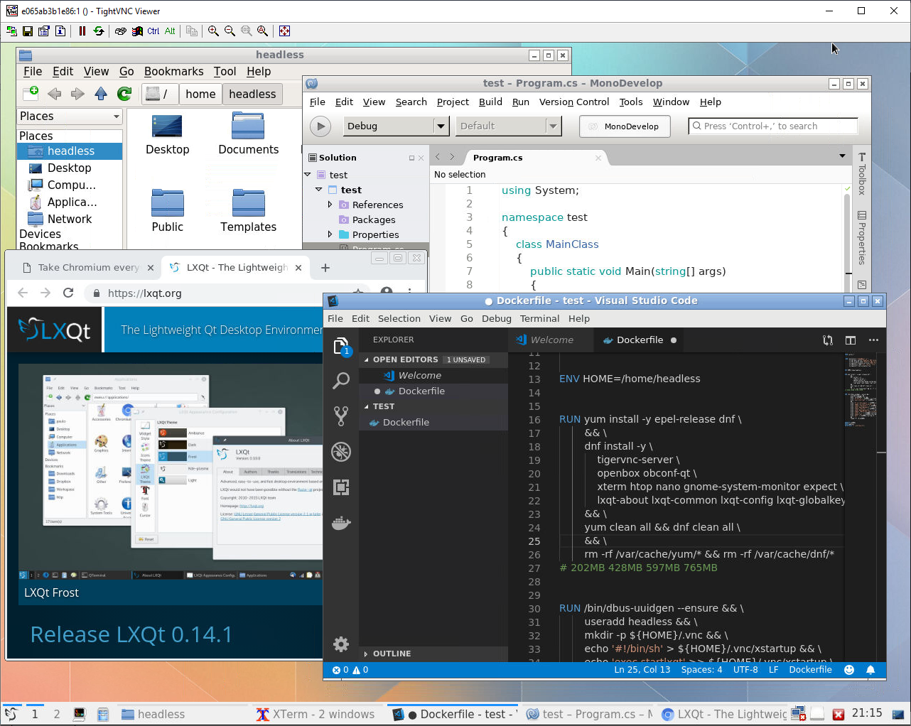

# Docker image with headless VNC environments

This repository contains a Docker image with headless VNC environments.

description in progress...





### Try
```sh
docker run -e password="YOUR_VNC_PASSWORD" -it --rm -p5901:5901 labeg/centos-lxqt-vnc
```

### For setup root and users password
For use root user, you must set a password. 
```sh
docker exec -u 0 -it CONTAINER_ID bash
```

Enter 'passwd root' and set password.

### Build
```sh
docker build -t labeg/centos-lxqt-vnc .
```